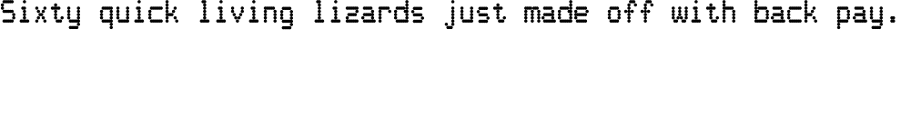

The Quassatio Font
=============

Remember the old dot-matrix printers? The really old ones with nine-pin printheads?
Ever get nostalgic for that appearance? Then this is the font for you!
Each character simulates a character matrix that's nine dots high, with
horizontal dot positioning at half-dot precision.

Licensed under the SIL Open Font License v1.1.

Work in progress.
